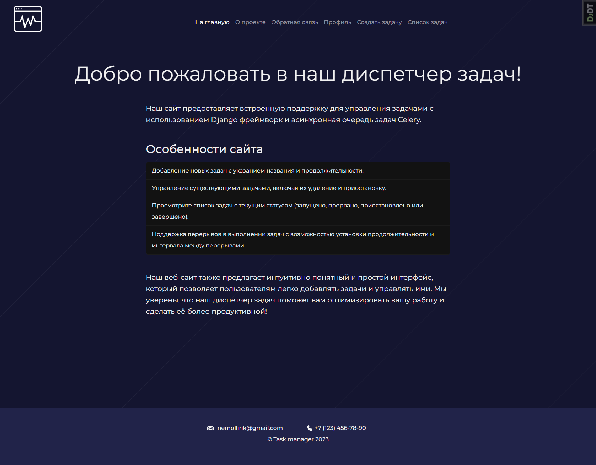
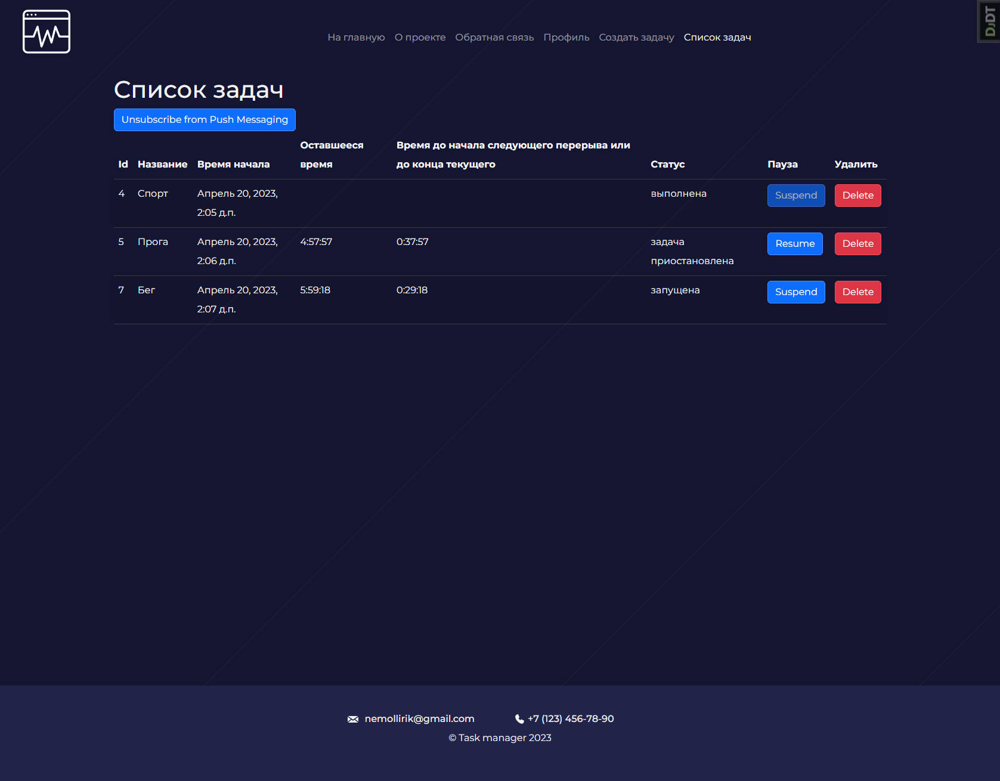
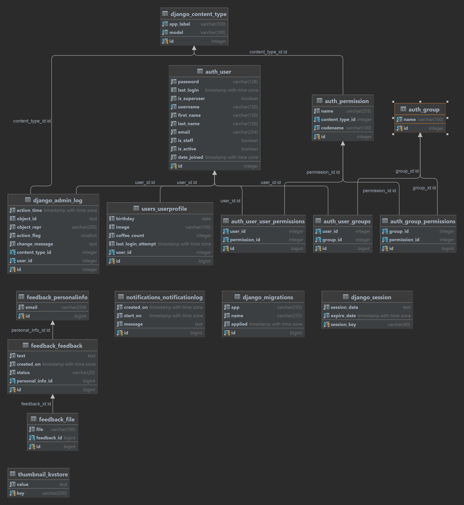

# task-manager


## Разработка

При локальной разработке мы используем:

- [`python`](https://www.python.org/downloads/release/python-3110/) (**необходим**) версия `^3.11`
- [`docker`](https://docs.docker.com/get-docker/) (**необходим**) версия `^20`

# Технологии

Основные технологии, используемые в проекте: `Django` `Containerization` `Websockets` `Celery tasks` `Jquery` `Ajax`
`Notifications`

## Инфраструктура

Для инфраструктуры мы использовали: `docker` `docker-compose` `celery` `flow`
`postgres` `redis`

## Django 

Из django мы использовали `Django ORM` `Django Admin` `Django Internalization` `Django Migrations`

## Быстрый старт

Инструкция по запуску проекта в dev-режиме:

Проверьте версию python и docker.

1) Создайте в директории проекта `/config/backend/` файл .env с переменными окружения. 
Пример этого файла содержится в репозитории под именем ".env.template".
2) Создайте в директории проекта `/config/db/` файл .env с переменными окружения. 
Пример этого файла содержится в репозитории под именем ".env.template".
3) Установите все библиотеки из файлов "requirements.txt" и "dev_requirements.txt".
```shell 
pip install -r ./requirements/dev_requirements.txt
``` 
4) Создайте и запустите проект в контейнере.

Для версии Docker Compose 1
```shell
docker-compose up
```
Для версии Docker Compose 2 
```shell
docker compose up
```
Веб-приложение будет доступно в localhost:8000, 
база данных в localhost:5432

### Необязательно

Компиляция локализации

Для версии Docker Compose 1
```shell
docker-compose exec backend python manage.py compilemessages
```
Для версии Docker Compose 2
```shell
docker compose exec backend python manage.py compilemessages
```

Создание локализации

Для версии Docker Compose 1
```shell
docker compose exec backend python manage.py makemessages -a
```
Для версии Docker Compose 2
```shell
docker-compose exec backend python manage.py makemessages -a
```

Запуск тестов

Для версии Docker Compose 1
```shell
docker compose exec backend python manage.py test
```
Для версии Docker Compose 2
```shell
docker-compose exec backend python manage.py test
```

Запуск линтера flake8
```shell
flake8 .
```

Запуск форматера Black
```shell
black .
```
## Скриншоты сайта



## ERD
